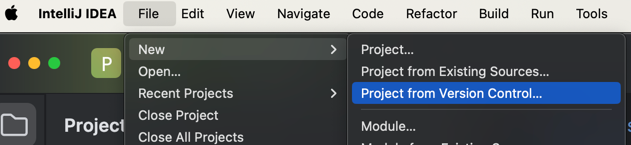
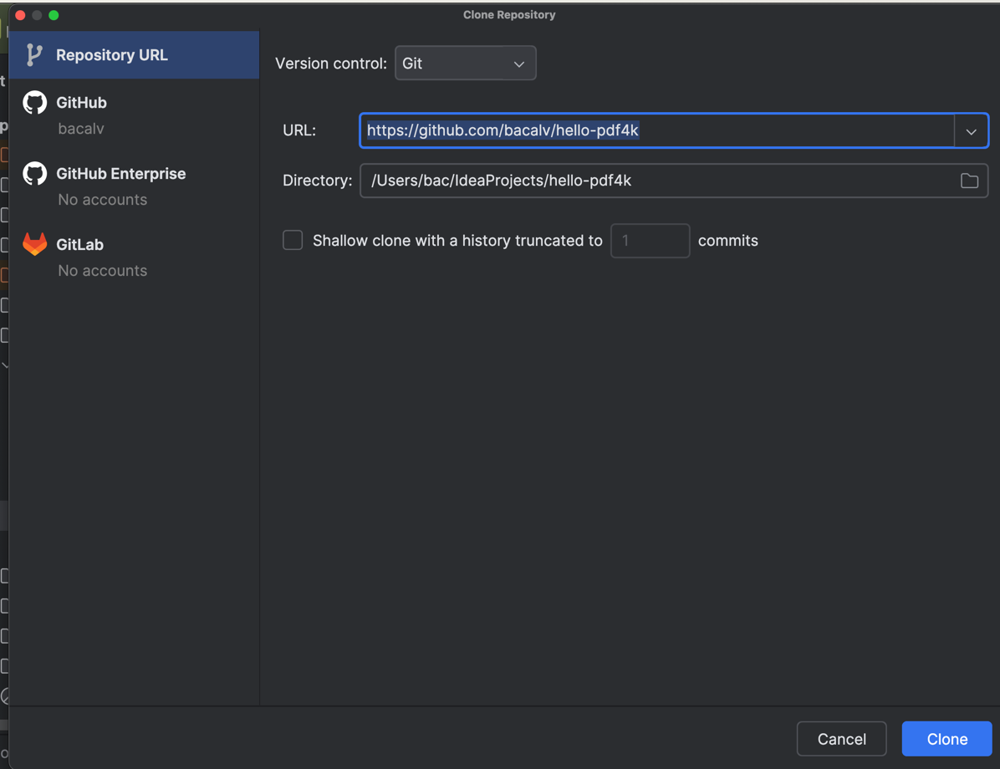
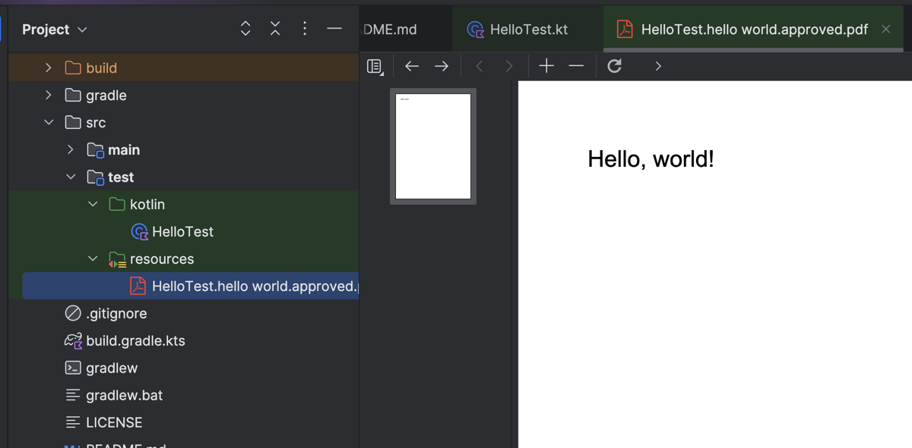
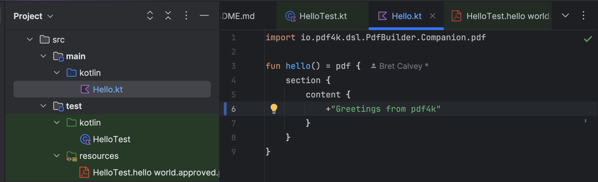
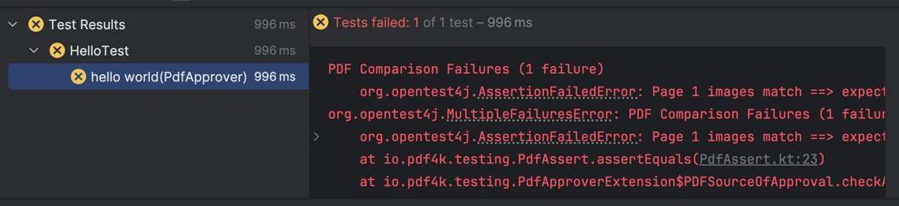
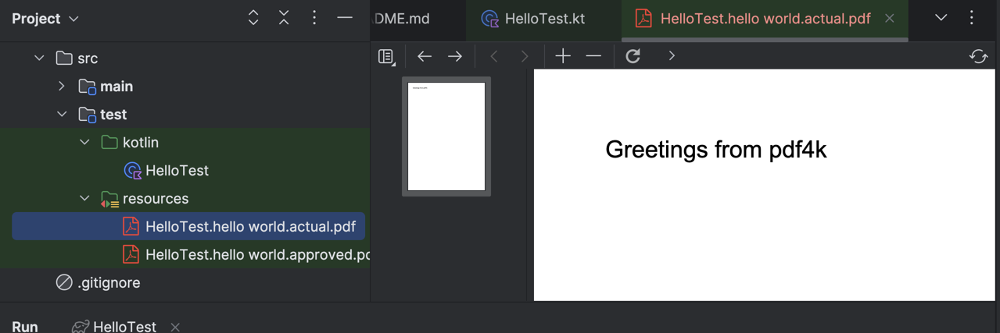
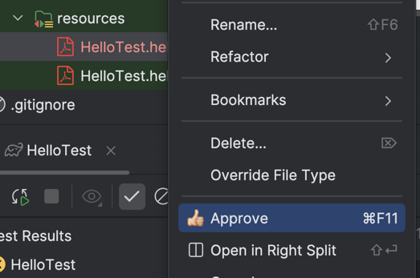

# pdf4k Testing Framework

pdf4k encourages you to write tests for your code.

The [testing library](../../libraries/testing/README.md) was the first module in this project that was defined.

We need to verify that the current version of our code generates the desired PDF output.

The testing library defines a JUnit 5 plugin that can be used to verify that your generated PDF files match an approved
version. It can be used stand-alone without any other pdf4k dependencies.

Based on the [okey-doke](https://github.com/dmcg/okey-doke) approval test framework, this module performs the following comparisons between generated
and approved PDF files...

- It compares pixel for pixel that each page in the generated PDF matches the approved version
- It checks that the metadata of the generated PDF (author, title, custom properties etc) matches the approved version
- It checks that external and internal links match the approved version
- It checks that security attributes and user permissions of the generated document match the approved version

See [PDFAssert](../../libraries/testing/src/main/kotlin/io/pdf4k/testing/PdfAssert.kt) for the code that performs these
assertions.

## Tutorial

The following tutorial assumes:

* You have a relevant version of Java installed.
* You have installed [IntelliJ IDEA Community Edition](https://www.jetbrains.com/idea/download).
* You have installed the [okey-doke IntelliJ plugin](https://plugins.jetbrains.com/plugin/9424-okey-doke-support).
* You have installed the [PDF Viewer plugin](https://plugins.jetbrains.com/plugin/14494-pdf-viewer).

### Clone the project in IDEA

* Enter the Github URL for the project (https://github.com/bacalv/hello-pdf4k).
* Click `Clone`.
* Click `Trust Project`

.



### Running the tests in IDEA

Assuming everything has imported successfully, you should now be able to run the tests.

Open the `HelloTest` class and run it.

You should get a passing test.

#### What just happened?

The test ran and generated a PDF containing the text `Hello, world!`.

The pdf4k testing framework verified that the generated PDF matches the approved version.

The approved file can be found under `src/test/resources` and is called `HelloTest.hello world.approved.pdf`.



### Changing the main code to generate some different content

Now if you open the main `Hello` class, you can change the text to something else...



### Running the tests again should fail

If you now run the test again, it should fail because the actual PDF generated does
not match the approved version...



The test failure error message will look something like this...

```
PDF Comparison Failures (1 failure)
	org.opentest4j.AssertionFailedError: Page 1 images match ==> expected: <true> but was: <false>
```

### Using the okey-doke plugin to approve the actual PDF

A new file will be written to the `src/test/resources` folder called `HelloTest.hello world.actual.pdf`...



If you right-click on this file in the Project explorer, you should see the following menu-item...



When you click this, the okey-doke plugin will replace the approved version with this actual version...

#### When no approval file exists

If you delete the approved file and run the test again, you will get an test failure error message that looks something
like this...

```
To approve...
cp '/Users/bac/IdeaProjects/hello-pdf4k/src/test/resources/HelloTest.hello world.actual.pdf' '/Users/bac/IdeaProjects/hello-pdf4k/src/test/resources/HelloTest.hello world.approved.pdf'

No approved file found
```

You can click on `Approve` as before, but this time, you will get the option to add the new approved file to source
control.

## Types of failure

TODO

[Back to index](./README.md)